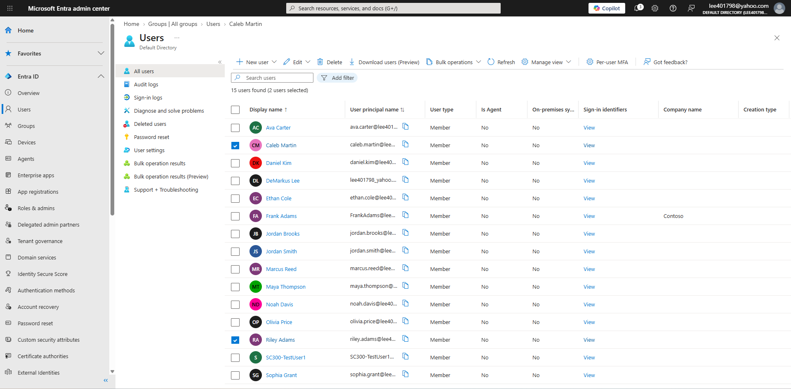
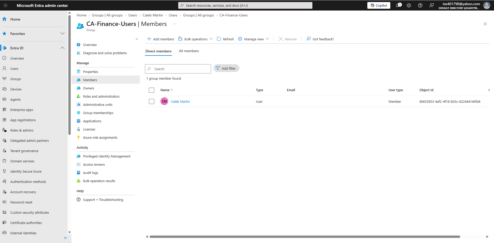
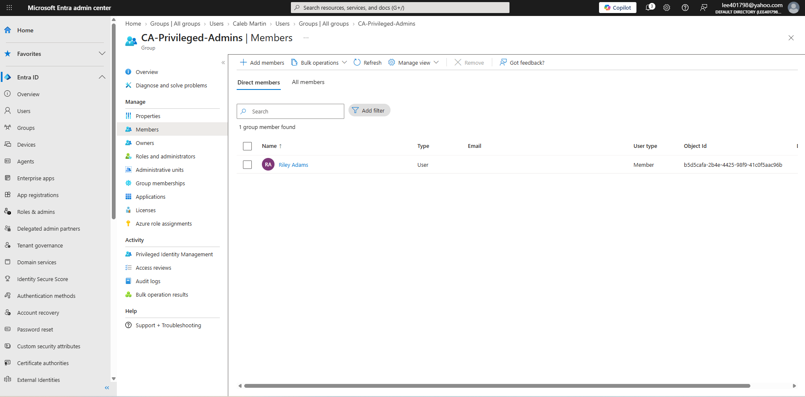
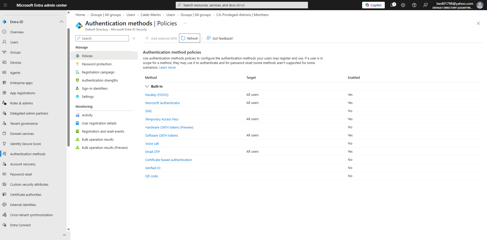
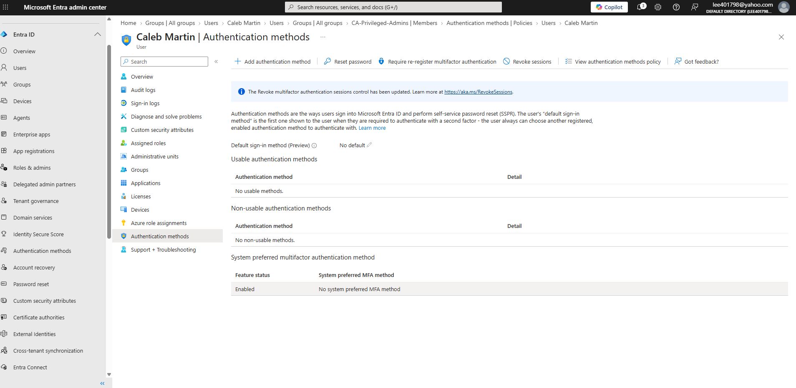
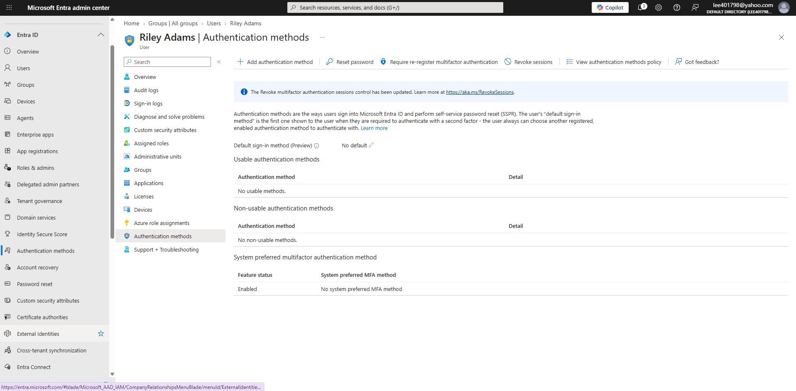
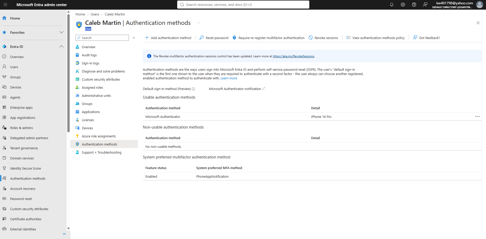
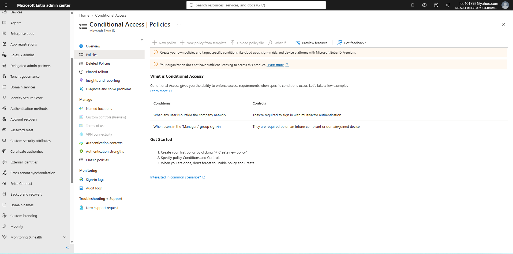

# Microsoft Entra ID — Conditional Access & MFA Lab

## Project Overview

This project explores multifactor authentication (MFA), Conditional Access policy design, and Zero Trust security principles using Microsoft Entra ID.

I created a simulated financial services environment to demonstrate authentication method registration, security group targeting, and identity protection planning.

**Lab status:** MFA registration completed. Conditional Access policies designed but not deployed because the tenant uses Microsoft Entra Free.

## Technologies and Concepts

- Microsoft Entra ID
- Microsoft Authenticator
- Security groups
- Conditional Access policy design
- Multifactor authentication
- Phishing-resistant authentication
- Zero Trust principles

## Business Scenario

Contoso Financial Services wants to strengthen identity security for Finance employees and privileged administrators.

Two test identities were created:

| User | Department | Security Group |
|---|---|---|
| Caleb Martin | Finance | CA-Finance-Users |
| Riley Adams | IT | CA-Privileged-Admins |

## Hands-On Implementation

1. Created two Microsoft Entra test identities.
2. Created assigned security groups for policy targeting.
3. Reviewed available authentication methods.
4. Registered Microsoft Authenticator for Caleb Martin.
5. Verified Caleb's registered authentication method.
6. Investigated Conditional Access availability and identified an Entra licensing limitation.

## Lab Evidence and Screenshots

### 1. Test Users
Created Caleb Martin and Riley Adams as simulated identities.

### 2. Finance Security Group
Assigned Caleb Martin to CA-Finance-Users.

### 3. Privileged Test Group
Assigned Riley Adams to CA-Privileged-Admins.

### 4. Available Authentication Methods
Reviewed authentication methods enabled in the Microsoft Entra tenant.

### 5. Caleb Before MFA Registration
Verified that Caleb initially had no registered authentication methods.

### 6. Riley Before MFA Registration
Reviewed Riley's authentication methods before configuration.

### 7. Caleb After MFA Registration
Successfully registered Microsoft Authenticator and verified it appeared as a usable authentication method.

### 8. Conditional Access Licensing Limitation
Confirmed that Conditional Access policy creation was unavailable with the tenant's current Entra Free license.

## Conditional Access Designs

Two policies were documented:

**Policy 1: Finance MFA**

Require MFA for members of `CA-Finance-Users`.

**Policy 2: Privileged Authentication**

Require phishing-resistant authentication for members of `CA-Privileged-Admins`.

Both designs specify report-only evaluation and planned emergency-access account exclusions.

[View the Conditional Access policy design](policies/conditional-access-design.md)

## Validation and Limitations

Microsoft Entra Free does not provide the licensing required to create and deploy these Conditional Access policies.

As a result, What If analysis, report-only policy evaluations, and enforcement testing were not performed.

## Skills Demonstrated

- Identity and group administration
- MFA registration and verification
- Authentication method analysis
- Conditional Access policy design
- Understanding licensing dependencies
- Security documentation and troubleshooting

## Next Steps

Continue SC-300 preparation through additional labs involving authentication, authorization, identity governance, and privileged access.
